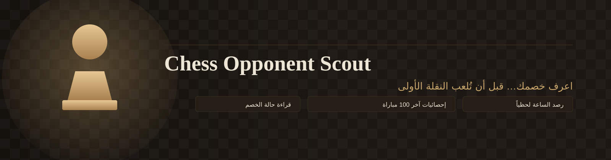
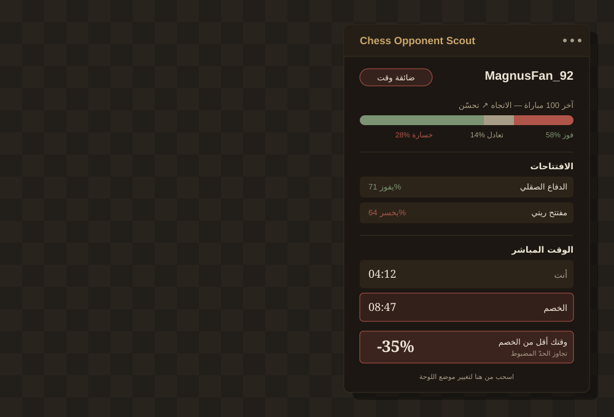
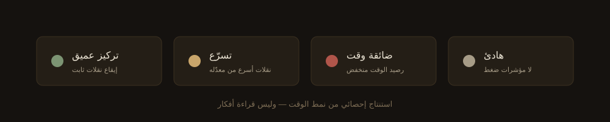

<div align="center">



<br/>


</div>

<br/>

قبل أن تُلعب أول نقلة، تعرف اللوحة على خصمك: كيف لعب آخر مئة مباراة، بأي افتتاح يفوز وبأي افتتاح ينهار، وهل ساعته تركض أسرع من ساعتك. كل هذا يظهر تلقائياً في نافذة صغيرة قابلة للسحب، فوق Lichess أو Chess.com مباشرة، بلا نسخ ولصق ولا تبويبات إضافية.

<br/>

## المحتويات

- [المحتويات](#المحتويات)
- [المزايا](#المزايا)
- [نقطة صراحة مهمة عن ميزة "حالة الخصم"](#نقطة-صراحة-مهمة-عن-ميزة-حالة-الخصم)
- [كيف تُرصد الساعة المباشرة؟](#كيف-تُرصد-الساعة-المباشرة)
- [التثبيت (وضع المطوّر)](#التثبيت-وضع-المطوّر)
- [الاستخدام](#الاستخدام)
- [هيكل الملفات](#هيكل-الملفات)
- [ملاحظات مهمة](#ملاحظات-مهمة)

<br/>

## المزايا



<br/>

| الميزة | التفاصيل |
|---|---|
| **إحصائيات الخصم** | آخر 100 مباراة، نسبة الفوز/الخسارة/التعادل، الاتجاه العام (تحسّن أو تراجع)، وأضعف وأقوى افتتاحاته — عبر الـ API العمومي المجاني لكل منصة |
| **الوقت المباشر** | ساعتك وساعة الخصم تتحدّثان لحظياً، مع تمييز واضح لمن يلعب الآن |
| **إنذار ضغط الوقت** | تنبيه مرئي + إشعار متصفح إذا أصبح وقتك أقل من وقت الخصم بنسبة تتجاوز حداً معيناً (35% افتراضياً، وقابل للتعديل) |
| **حالة الخصم** | قراءة تقديرية (تركيز عميق / تسرّع / ضائقة وقت / هادئ) مبنية على تحليل نمط نقلاته الزمنية مقارنة بمعدّله ورصيد وقته المتبقي |

<br/>

## نقطة صراحة مهمة عن ميزة "حالة الخصم"



هذه القراءة **استنتاج إحصائي من نمط الوقت فقط**، وليست قراءة أفكار. فهي مبنية على قواعد واضحة — مقارنة سرعة النقلة الأخيرة بمعدل اللاعب، ونسبة الوقت المتبقي — لا على ذكاء اصطناعي يحلل الأفكار. اعتبرها مؤشراً مساعداً، لا حقيقة مؤكدة.

<br/>

## كيف تُرصد الساعة المباشرة؟

لا يوجد API رسمي لقراءة وقت المباراة لحظياً، لذلك تراقب الإضافة الصفحة نفسها. بدل الاعتماد على أسماء أصناف CSS ثابتة — التي تتغير مع كل تحديث للموقع — تبحث الإضافة عن عنصرين يتحركان **فعلاً** كساعة عدّ تنازلي حقيقية، قبل أن تعتمدهما. هذا يجعلها أكثر مقاومة لتغييرات تصميم الموقع من الاعتماد على selectors ثابتة.

إذا لم تُكتشف الساعة خلال ثوانٍ، تبقى بقية اللوحة — الإحصائيات والافتتاحات — تعمل بشكل طبيعي.

<br/>

## التثبيت (وضع المطوّر)

1. حمّل مجلد `chess-opponent-scout` وفكّ ضغطه إن كان مضغوطاً.
2. افتح Chrome واذهب إلى `chrome://extensions`.
3. فعّل **وضع المطوّر** (Developer mode) من الزاوية العلوية اليمنى.
4. اضغط **تحميل غير مضغوط** (Load unpacked) واختر مجلد `chess-opponent-scout`.
5. *(اختياري لكن مفيد)* اضغط على أيقونة الإضافة وسجّل اسمك على Lichess و/أو Chess.com — هذا يساعد التخمين التلقائي على تمييز اسمك عن اسم الخصم.

<br/>

## الاستخدام

1. ادخل لمباراة على lichess.org أو chess.com — تظهر لوحة الرصد **تلقائياً** عند بداية أي مباراة جديدة.
2. يمكنك أيضاً فتحها أو إغلاقها يدوياً بالضغط على الأيقونة العائمة (♞) أسفل يمين الصفحة.
3. اسحب اللوحة من رأسها (الشريط العلوي) لأي مكان تريحك فيه — يُحفظ الموقع تلقائياً.
4. ستحاول الإضافة تخمين اسم الخصم تلقائياً وتحلّله فوراً، لكن **تأكد من الاسم أو عدّله يدوياً** إذا لزم — فالتخمين ليس مضموناً.
5. تعرض اللوحة:
   - نسبة الفوز/الخسارة/التعادل لآخر 100 مباراة، والاتجاه العام
   - أضعف افتتاحات الخصم (يخسر بها كثيراً) وأقواها (يفوز بها كثيراً)
   - وقتك ووقت الخصم لحظياً، مع تمييز من يلعب الآن
   - إنذار إذا تأخرت بالوقت عن خصمك بنسبة تتجاوز الحد المضبوط (زر ⚙ لتعديله)
   - حالة الخصم التقديرية

<br/>

## هيكل الملفات

```
chess-opponent-scout/
├── manifest.json        إعدادات الإضافة (Manifest V3)
├── background.js        يجلب المباريات من الـ API، يحسب الإحصائيات، ويرسل إشعارات الإنذار
├── utils.js              دوال مشتركة (تحليل نص الساعة، بناء عناصر DOM)
├── clock-tracker.js      محرك رصد الساعة المباشرة (اكتشاف ذاتي بدون selectors ثابتة)
├── state-engine.js       خوارزمية تصنيف "حالة الخصم" من نمط الوقت
├── drag.js               منطق السحب وحفظ موقع اللوحة
├── content.js            يبني لوحة الرصد، يربط كل الأجزاء ببعضها، ويكتشف بداية المباراة تلقائياً
├── overlay.css           تصميم اللوحة
├── popup.html/popup.js   نافذة إعدادات بسيطة لحفظ اسمك
└── icons/                أيقونات الإضافة
```

<br/>

## ملاحظات مهمة

- **البيانات محدودة بما هو علني.** على Lichess تُجلب المباريات مباشرة عبر API الرسمي. على Chess.com تُجلب عبر أرشيف الشهور العلني (Published-Data API)، وقد يستغرق جلبها لعدة أشهر ماضية وقتاً أطول قليلاً.
- **اسم الافتتاح على Chess.com** يُستخرج من رابط ECO الذي يوفره API (وليس دائماً موجوداً لكل مباراة)، لذلك قد تظهر بعض المباريات كـ"افتتاح غير معروف".
- **كشف اسم الخصم تلقائياً غير مضمون 100٪.** مواقع الشطرنج تُحدّث بنية صفحاتها من وقت لآخر، فإذا توقف التخمين التلقائي عن العمل، اكتب اسم الخصم يدوياً في الحقل — الإضافة تبقى تعمل بشكل كامل.
- لا تُرسل الإضافة أي بيانات لخوادم خارجية غير lichess.org و api.chess.com، مباشرة من متصفحك.

<br/>

<div align="center">

<br/>
<sub>Chess Opponent Scout — إضافة كروم مستقلة، لا علاقة رسمية لها بـ Lichess أو Chess.com</sub>
</div>
